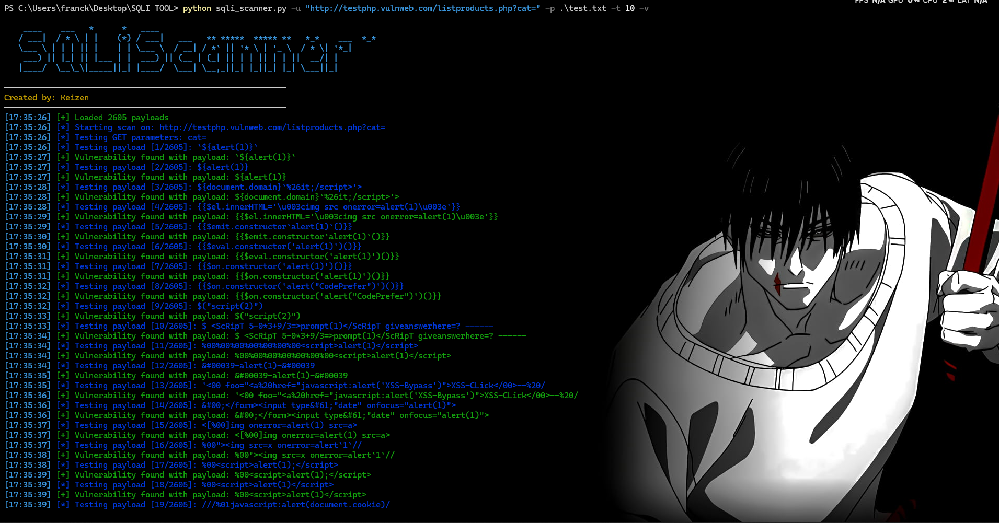

# SQLI_TOOL

An advanced SQL Injection Scanner that allows you to test URLs for SQL injection vulnerabilities using different payloads.




## Features
- Scan a single URL or a list of URLs from a file.
- Customize the number of threads for faster scanning.
- Use predefined or custom payloads to test for vulnerabilities.
- Supports verbose output and timeout customization.

## Installation

To install the required dependencies, use the following command:

```bash
pip install -r requirements.txt
```

Usage

To run the scanner:
```bash
python sqli_scanner.py -u <URL> -p <path_to_payloads_file> [-t THREADS] [-v] [--timeout TIMEOUT]
```
Options:

    -h, --help Show help message and exit
    -u, --url URL Single URL to scan
    -f, --file FILE File containing URLs to scan
    -p, --payloads PAYLOADS Path to payload file
    -t, --threads THREADS Number of threads
    -v, --verbose Enable verbose output
    --timeout TIMEOUT Request timeout in seconds
  ## Example
   
    python sqli_scanner.py -u http://testphp.vulnweb.com/listproducts.php?cat= -p payloads.txt
     
   Scan URLs from a file:

     python sqli_scanner.py -f urls.txt -p payloads.txt -t 4 -v


License

This project is licensed under the MIT License - see the LICENSE file for details.

   
